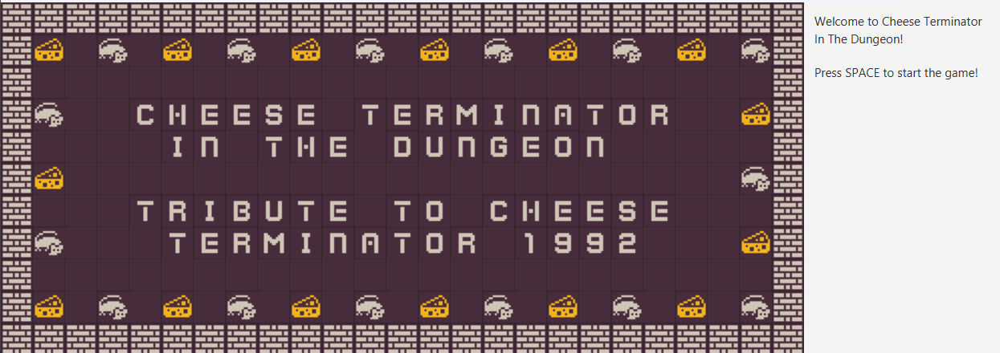
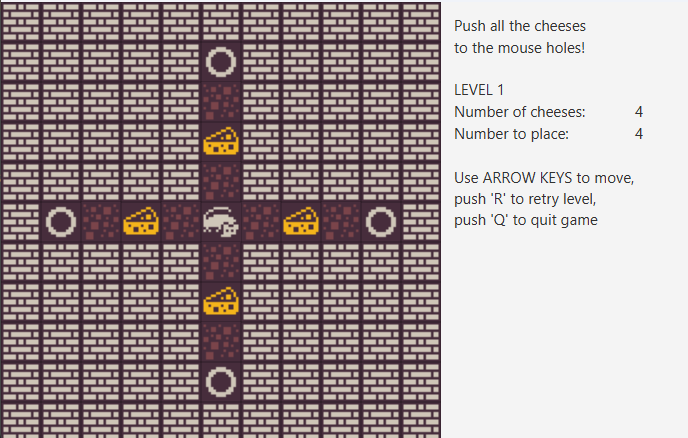
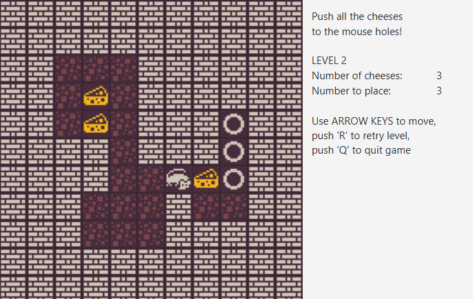
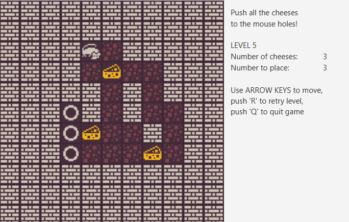

# Cheese Terminator in the Dungeon - a Java/JavaFX sokoban type offline game

<!-- TABLE OF CONTENTS -->
<details>
  <summary>Table of Contents</summary>
  <ul>
    <li><a href="#what-is-cheese-terminator-in-the-dungeon">What is Cheese Terminator in the Dungeon?</a></li>
    <li><a href="#built-with">Built With</a></li>
    <li><a href="#description">Description</a></li>
    <li><a href="#main-features">Main features</a></li>
    <li><a href="#developer">Developer</a></li>
    <li><a href="#how-to-run-this-app">How to run this app?</a></li>
    <ol>
        <li><a href="#prerequisites">Prerequisites</a></li>
        <li><a href="#installation-and-run">Installation and run</a></li>
    </ol>
    <li><a href="#how-to-use">How to use?</a></li>
  </ul>
</details>



## What is Cheese Terminator in the Dungeon?

CTD is a sokoban-type offline game, developed in Java using JavaFX for graphics. It's tribute remake of an old windows game 'Cheese Terminator' developed by Zsolt Krajcsik.

The Game uses classic Dungeon Crawl tile for visual experience. 

I also intended this game to be a basis for more complex dungeon games.


## Built with

[](#)
[](#)
[](#)
[](#)
[](#)
<br />
  
## Description

In this sokoban-like game players are to push every cheese to the mouse holes avoiding deadlocks. Once all cheeses are in the holes players proceed to the next level. The aim of the game is to complete all the levels.



## Main features

- JavaFX UI
- Classic dungeon crawl tiles (32*32)
- Mouse movement control by keyboard
- Retry level and quit
- Game status display on status pane
- Welcome and victory screens
- Undo function (last move) (TODO)
- Postgres Database and Spring Data JPA introduction for saving game data (TODO)
- Users handling - Hall of fame (TODO) 
- Saving game state (TODO)
- New tiles, direction sensitive heading of the mouse (TODO)



## Developer
- [Levente Fülöp](https://github.com/fulopl)


## How to run this app?

### Prerequisites
- Ensure the following are installed on your computer:
    - Git (https://git-scm.com/downloads)
    - Docker Desktop (https://www.docker.com/products/docker-desktop/)

### Installation and run
To set up the project locally:
1. Clone the github repo to your computer by typing the following command in the command shell:
```sh
   git clone https://github.com/fulopl/cheese-terminator 
   ```
2. Make sure Docker Desktop is running.
3. Build the application container and run the app by typing the command below (the build process may take some minutes):
```sh
   docker compose up
   ```


## How to use?
- Push the cheeses to the mouse holes (circles) to complete each level.
- You can control the mouse with the keyboard arrow keys.
- Push 'R' any time to restart a level.
- To quit the game press 'Q'.
- After quit remove the docker containers by entering "docker compose down" in the shell





