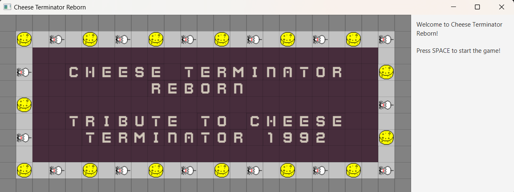
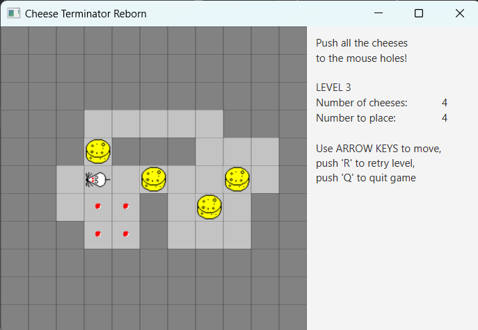
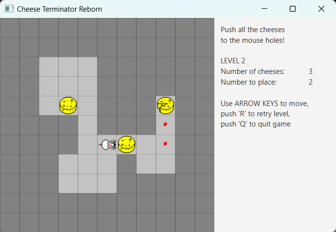
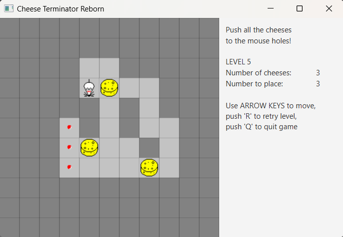

# Cheese Terminator Reborn - a Java/JavaFX sokoban type logical game

<!-- TABLE OF CONTENTS -->
<details>
  <summary>Table of Contents</summary>
  <ul>
    <li><a href="#what-is-cheese-terminator-reborn">What is Cheese Terminator Reborn?</a></li>
    <li><a href="#built-with">Built With</a></li>
    <li><a href="#description">Description</a></li>
    <li><a href="#main-features">Main features</a></li>
    <li><a href="#developer">Developer</a></li>
    <li><a href="#how-to-run-this-app">How to run this app?</a></li>
    <ol>
        <li><a href="#prerequisites">Prerequisites</a></li>
        <li><a href="#installation-and-run">Installation and run</a></li>
    </ol>
    <li><a href="#how-to-use">How to use?</a></li>
  </ul>
</details>



## What is Cheese Terminator Reborn?

Cheese Terminator Reborn is a remake of an old Windows 3.1 game 'Cheese Terminator' developed by Zsolt Krajcsik in 1992.<br/>
The original game was distributed for free in Hungary and Poland to Win 3.1 users who completed a Microsoft survey.</br>
</br>
It is a sokoban-type logical game, developed in Java using JavaFX for graphics.<br/>
I used sprites from the original game, and was lucky to find the code for all the original 50 levels.<br/>

During development, I tried to create an architecture that makes it suitable to be the basis for more complex logic or dungeon-like games.


## Built with

[](#)
[](#)
[](#)
[](#)
[](#)
<br />
  
## Description

In this sokoban-like game players are to push every cheese to the mouse holes avoiding deadlocks.<br/> Once all cheeses are in the holes players proceed to the next level. The aim of the game is to complete all the 50 levels.



## Main features

- JavaFX UI
- Mouse movement control by keyboard
- Level retry and quit option
- Game status display on status pane
- Welcome and victory screens
- Original 32*32 px tiles, direction sensitive heading of the mouse
- Tail movement animation (TODO)
- Undo last move (TODO)
- Steps/time counter (TODO)
- Postgres Database and Spring Data JPA introduction for saving game data (TODO)
- Users handling - Hall of fame, level records (TODO) 
- Saving game state (TODO)
- Level training (TODO)



## Developer
- [Levente Fülöp](https://github.com/fulopl)


## How to run this app?

### Prerequisites
- Ensure the following are installed on your computer:
    - Git (https://git-scm.com/downloads)
    - Docker Desktop (https://www.docker.com/products/docker-desktop/)

### Installation and run
To set up the project locally:
1. Clone the github repo to your computer by typing the following command in the command shell:
```sh
   git clone https://github.com/fulopl/cheese-terminator 
   ```
2. Make sure Docker Desktop is running.
3. Build the application container and run the app by typing the command below (the build process may take some minutes):
```sh
   docker compose up
   ```


## How to use?
- Push the cheeses to the mouse holes (circles) to complete each level.
- You can control the mouse with the keyboard arrow keys.
- Push 'R' any time to restart a level.
- To quit the game press 'Q'.
- After quit remove the docker containers by entering "docker compose down" in the shell





